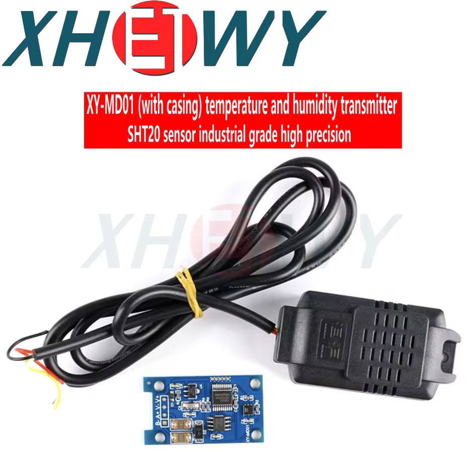

# Attic Fan Controller

This program measures humidity and temperature then decides whether or not the relay-controlled fans should be on or off.

It is designed to operate in one of the following modes:

- **Humidstat**: (default) when relative humidity is higher than a specified activation threshold the fans will be switched on until it falls below a specified deactivation threshold.
- **Manual**: each relay/channel is set to on or off and that value is maintained until changed.

A web interface allows control and monitoring.

## Configuration

In order for this project to compile you'll need to create a `project_config.h` file at the root.
You can duplicate the `project_config_template.h`, rename it, and customize it for this purpose.

## Hardware

* [Waveshare ESP32-S3-Relay-6CH](https://www.waveshare.com/wiki/ESP32-S3-Relay-6CH)
* [HiLetgo RS485 SHT20 Temperature Humidity Sensor Module](https://www.amazon.com/dp/B082F8WXD8) (uses [Sensirion SHT20](https://sensirion.com/media/documents/CCDE1377/635000A2/Sensirion_Datasheet_Humidity_Sensor_SHT20.pdf) internally).
  I believe this is equivalent to
  [XY-MD01 Temperature and Humidity SHT20 Sensor Monitoring Modbus RS485 (With Shell)](https://www.amazon.com/XY-MD01-Temperature-Humidity-Sensor-Monitoring/dp/B0C7GQJ5P7)
  (also found on [aliexpress](https://www.aliexpress.us/item/3256806675754758.html)):
  